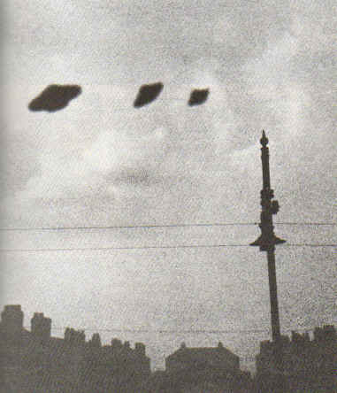
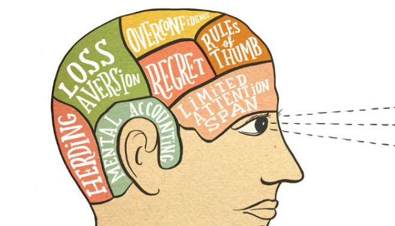
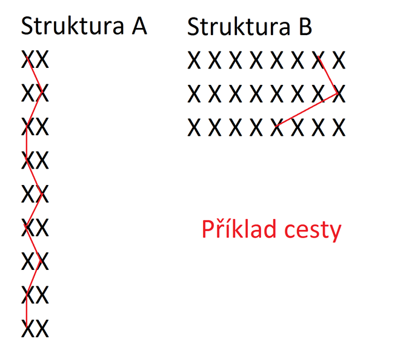
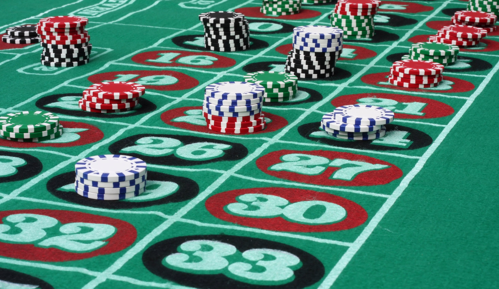
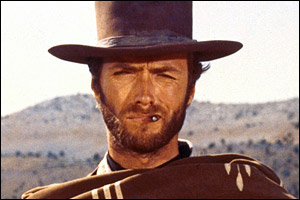
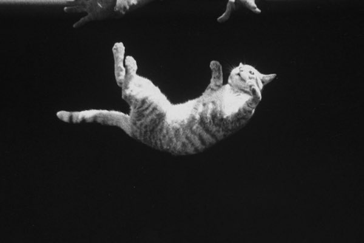

# Psychologické aspekty obchodování
Petr Sahula
Quantitative Finance Meetup (Praha)

---

# Nejprve příběh...

---

# Kognitivní disonance
 - Publikováno v roce 1957 Leonem Festingerem
 - Průlomová psychologická teorie
 - Ohromný vliv na další výzkum v oblasti psychologie rozhodování
 - Americká sociální psychologie (Kurt Lewin, Leon Festinger, Bluma Zeigerniková, Stanley Schachter a další)

---

# Kognitivní disonance
 - Konfirmační zkreslení (Confirmation Bias)
 - Minimalizace pochyb potom co se rozhodneme pro jedno řešení
 - Obhajování špatných variant kvůli předchozím rozhodnutím či investici úsilí
 - Proč se lidé rozčilují při výměně názorů?

---

# Locus of Control
 - Julian Rotter (1954)
 - **Vnitřní** - chyby přisuzejeme sami sobě
 - **Vnější** - chyby přisuzejem vnějším okolnostem
 - **Iluze kontroly:** přisuzování kladných výsledků svému intelektu
 - **Základní atribuční chyba**
 - **Zkreslení sloužící sobě**

---

# Behaviorální ekonomie
 - Proč a jak se lidé ekonomicky rozhodují?
 - Kognitivní a sociální psychologie
 - Ekonomie, matematika
 - Heuristiky, přerámování, tržní anomálie
 - Studium kognitivních zkreslení v ekonomickém rozhodování

---

# Dan Ariely
 - Popularizátor behaviorální ekonomie
 - **Kniha:** Jak drahé je zdarma?
 - **Kniha:** Jak drahá je intuice?
 - Přednášky na TED

---
**Malcolm Gladwell**: Tipping Point, Outliers, Blink

**Hans and Ola Rosling:** How not to be ignorant about the world

https://www.ted.com/talks/hans_and_ola_rosling_how_not_to_be_ignorant_about_the_world

---

# Daniel Kahneman & Amos Tversky
 - matematičtí psychologové
 - Framing & Prospect Theory
 - **Kniha:** Thinking Fast and Slow
 - Nobelova cena za ekonomii v roce 2002 (Tversky se ji už nedožil)
 - Kognitivní zkreslení

---

# Ve které struktuře je více cest?

---

# Heuristika dostupnosti
  - věci které jsou okamžitě zřejmé
  - upřednostňování informací, které si lze snado vybavit
  - pokud nás to napadlo tak to musí být důležité
  - silnější neuronová spojení -> líbí se nám to co vídáme často
  - neposuzujeme všechny informace stejnou měrou
  - "oblíbená teorie"

---

---

# Base rate fallacy
  - 1 řidič je opilý (100% jistota)
  - 999 řidičů není opilých (5% false positive => 49.95)
  - 1/(1 + 49.95) => 0.019627
  - Bayesova věta
  - konkrétním informacím přisuzujeme větší váhu
  - Kahneman a Tversky: důkaz nedokonalosti naší mysli

---

---

# Gambler's fallacy
  - teď nevyhrávám, musí se to otočit, štěstí se usměje
  - pokud se něco děje více často, bude se to dít méně často a naopak
  - malé vzorky jsou reprezentací populace

---

# Conjunction fallacy

**RGRRR**

**GRGRRR**

**GRRRRR**

---

# Conjunction fallacy

  - Reprezentativnost
  - Pravděpodobnost výskytu jevu je vždy vyšší než **p** výskytu dvou jevů současně
  - Specifičtější informace je lépe představitelná
  - Linda
  - Occamova břitva?

---

# Clustering illusion

 - Texaský Ostrostřelec (Sharpshooter)
 - Podobnosti v datech jsou vyzdvihovány a rozdíly ignorovány
 - Falešné pravidelnosti

---

# Clustering illusion

  - Lidé falešně identifikují vzory tam kde nejsou
  - False positive mi umožní přežít
  - Podhodnocování variability u malých náhodných vzorků

---

# Risk Aversion
  - Volíme konzervaivnější alternativy. Ménší risk, ale i výdělek.
  - Snaha o redukci nejistoty
  - risk-averse, risk-neutral, risk-loving
  - Hod mincí $50 a $100

---

# Ambiquity aversion (Ellsberg Paradox)
  - V krabici je 30 červenych a 60 žlutych nebo černych (poměr neznáme) míčků
  - Hra1: Pokud vytáhneš červený míček dostaneš $100.
  - Hra1: Pokud si vytáhneš černý míček dostaneš $100.
  - Hra2: Pokud si vytáhneš červený nebo žlutý míček dostaneš 100$.
  - Hra2: Pokud si vytáhneš černý nebo žlutý míček dostaneš 100$.

---

---

# Survivorship bias
  - Usuzujeme pouze na základě úspěšných příkladů
  - Neexistující, dávno zkrachovalé společnosti nejsou započítávány do finanční analyzy
  - Ignorování všech neúspěšných pokusů
